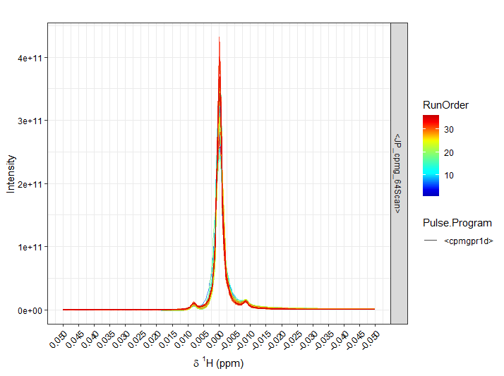
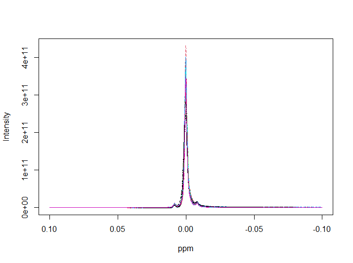
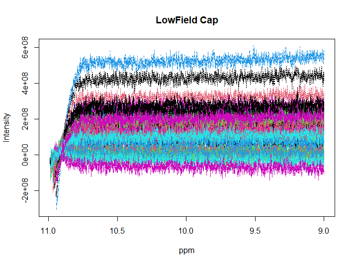
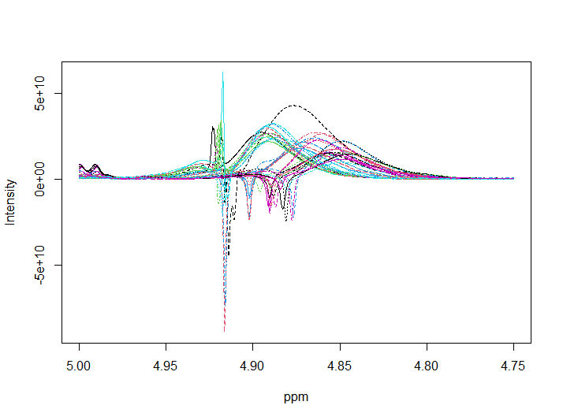
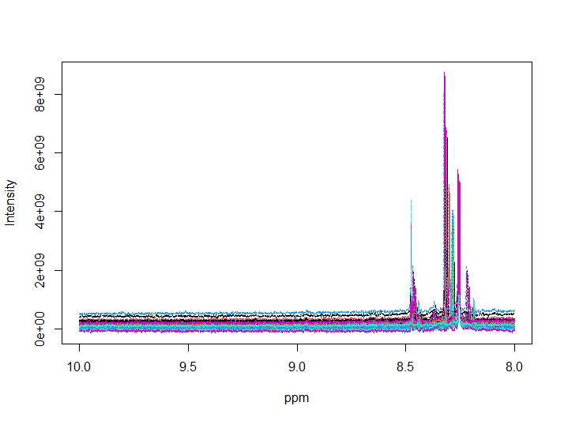
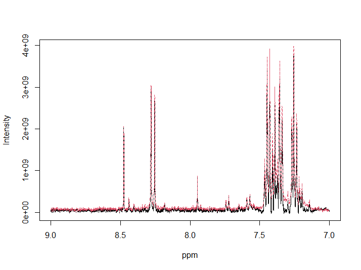
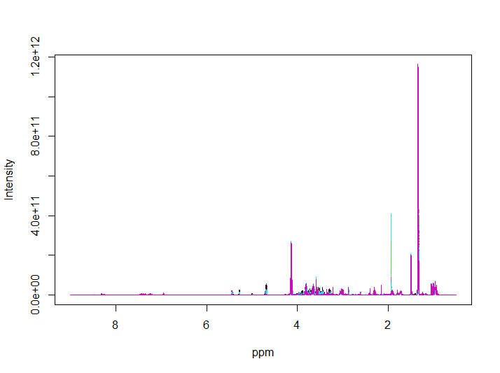

# Data pre-processing 
Before performing statistical analysis, data pre-processing is a very crucial step following data acquisition. This is to ensure the good quality of spectral data that may need some corrections in baseline and alignment. Missing data need to be reimputed. Normalisation may also be required for some datasets.

## Table of Contents
1. [NMR data pre-processing](#nmr)
2. [LC-MS data pre-processing](#lcms)

## NMR data pre-processing <a name="nmr"></a>
### Step 1. Open R studio program 


### Step 2. Set working directory 

```
#set working directory 
setwd("D:/CliNaP-M/Metabom8")
```


### Step 3. Load library packages including metabom8, remotes and devtools

```
# load packages
library(metabom8)
library(remotes)
library(devtools)
```

### Step 4. Define path to NMR experiment

```
# define path to NMR experiments
data.file <- ""D:/CliNaP-M/Metabom8/NMR"
```

### Step 5. Import NMR data

```
# import 1D MRS data
read1d_proc(data.file, exp_type=list(PULPROG='cpmgpr1d'))
```

### Step 6. Plot single spectrum

```
# use 'spec' to plot a single pectrum, e.g., in row position 15:
spec(X[51,], ppm, shift = range(ppm), interactive=F)
```
**You will obtain the result below**


### Step 7. Plot overlay spectra 

```
# use 'matspec' to overlay spectra, in ppm range 0 to 10
matspec(X, ppm, shift = c(-1, 10), interactive=F)
```
**You will obtain the result below**


### Step 8. Create run order
```
# create run-order based on acquisition date
meta$runOrder=rank(as.POSIXct(meta$a_DATE))
```

### Step 9. Plot TSP signal
```
# plot TSP signal
specOverlay(X, ppm, shift=c(-0.05,0.05),
            an=list( 'Facet'=meta$a_EXP, # facet
                     'RunOrder'=meta$runOrder, # colour
                     'Pulse Program'=meta$a_PULPROG) # linetype
) # linetype
```
**You will obtain the result below**



### Step 10.  Perform TSP calibration

- **TSP calibration**
```
# perform TSP calibration
X_cal=calibrate(X, ppm, type='tsp')
```

- **Plot TSP after calibration**
```
# plot TSP after calibration
matspec(X_cal, ppm, shift=c(-0.1,0.1), interactive=F)
```

**You will obtain the result below** 



### Step 11. Calculate quality control measures in water region, low field and up field
```
# calculate quality control measures
matspec(X_cal, ppm, shift=c(4.5,5), interactive=F, main='Residual Water')
matspec(X_cal, ppm, shift=c(9,11), interactive=F, main='LowField Cap')
matspec(X_cal, ppm, shift=c(-1,1), interactive=F, main='UpField Cap')
```
**You will obtain the result below**


The NMR spectra for water region



The NMR spectra for low field


The NMR spectra for up field

### Step 12. Cut unwanted region including TSP, water and noise
#### 12.1 TSP region
- **Check TSP region**
```
#Check TSP region
matspec(X, ppm, shift = c(-0.05, 0.05), interactive=F)
```

**You will obtain the result below**


- **Specify TSP region to be removed** 
```
#Specify TSP region to be removed
idx_tsp=get_idx(range=c(min(ppm), 0.5), ppm)
```

#### 12.2 Water region
- **Check water region** 
```
#Check water region
matspec(X, ppm, shift = c(4.75, 5), interactive=F)
```

**You will obtain the result below**



- **Specify water region to be removed**
```
#Specify water region to be removed
idx_water=get_idx(range=c(4.75, 4.98), ppm)
```

#### 12.3 Down field noise region (ppm 9-10) 
- **Check down field noise region**
```
#Check downfield noise region
matspec(X, ppm, shift = c(8, 10), interactive=F)
```

**You will obtain the result below**



- **Specify downfield noise to be removed**
```
#Specify downfield noise to be removed
idx_noise=get.idx(range=c(9, max(ppm)), ppm)
```

#### 12.4 Gather all regions to be removed and excision of TSP, water and noise regions
```
#Gather all regions to be removed
idx_rm=c(idx_tsp, idx_water, idx_noise)

# Exision of TSP, res. water and noise regions
X_cut=X_cal[,-idx_rm]
ppm=ppm[-idx_rm]
```

### Step 13. Baseline correction
```
# Baseline correction
X_bl=bcor(X_cut)
```
**Visual assessment**
```
# visual assessment
Xcompare=rbind(X_bl[1,], X_cut[1,])
matspec(Xcompare, ppm, shift = c(7, 9), interactive=F)
matspec(Xcompare, ppm, shift = c(3,4), interactive=F)
```
**You will obtain the result below**




The red dash line represents the uncorrected baseline, the black line represents the baseline correction spectrum. 


### Step 14. Normalisation, PQN method 
```
# PQN normalisation
X_pqn=pqn(X_bl, add_DilF = 'NULL')
```

### Step 15. Visual inspection of the pre-processed NMR spectra

```
#The visual inspection of the pre-processed NMR spectra:
matspec(X_pqn, ppm, shift = range(ppm), interactive=F)                                 
matspec(X_pqn, ppm, shift = c(1.2, 1.7), interactive=F)
```

**You will obtain the result below**



The pre-processed NMR spectra at ppm 1-9.


The pre-processed NMR spectra at ppm 1.2-1.7.

### Step 16. Export NMR spectra to data table
#### 16.1 Transpose data of x_pqn and ppm

```
#Transpose NMR data to create csv file
x_pqn2 <- t(x_pqn)
ppm2 <- t(ppm)
```

#### 16.2 Export NMR data to .csv file 

```
#Export NMR data to .csv file
write.table(X_pqn2, file = "x_pqn2", quote = FALSE, sep = ", ",
            eol = "\n", na = "NA", dec = ".", row.names = FALSE,
            col.names = TRUE, qmethod = c("escape", "double"),
            fileEncoding = "")

write.table(ppm3, file = "ppm3", quote = FALSE, sep = " ,",
            eol = "\n", na = "NA", dec = ".", row.names = FALSE,
            col.names = TRUE, qmethod = c("escape", "double"),
            fileEncoding = "")
 ```

#### 16.3 Open csv file in excel to rearrange the format file for multivariate analysis


---
[↥ **Back to top**](#top)

## LC-MS data pre-processing <a name="lcms"></a>
Some text here

---
[↥ **Back to top**](#top)
