# Data pre-processing 
Before performing statistical analysis, data pre-processing is a very crucial step following data acquisition. This is to ensure the good quality of spectral data that may need some corrections in baseline and alignment. Missing data need to be reimputed. Normalisation may also be required for some datasets.

## Table of Contents
1. [NMR data pre-processing](#nmr)
2. [LC-MS data pre-processing](#lcms)

## NMR data pre-processing <a name="nmr"></a>
### Step 1. Open R studio program 


### Step 2. Set working directory 

```
#set working directory 
setwd("D:/CliNaP-M/Metabom8")
```


### Step 3. Load library packages including metabom8, remotes and devtools

```
# load packages
library(metabom8)
library(remotes)
library(devtools)
```

### Step 4. Define path to NMR experiment

```
# define path to NMR experiments
data.file <- ""D:/CliNaP-M/Metabom8/NMR"
```

### Step 5. Import NMR data

```
# import 1D MRS data
read1d_proc(data.file, exp_type=list(PULPROG='cpmgpr1d'))
```

### Step 6. Plot single spectrum

```
# use 'spec' to plot a single pectrum, e.g., in row position 15:
spec(X[15,], ppm, shift = range(ppm), interactive=F)
```
**You will obtain the result below**


### Step 7. Plot overlay spectra 

```
# use 'matspec' to overlay spectra, in ppm range 0 to 10
matspec(X, ppm, shift = c(-1, 10), interactive=F)
```
**You will obtain the result below**


### Step 8. Create run order
```
# create run-order based on acquisition date
meta$runOrder=rank(as.POSIXct(meta$a_DATE))
```

### Step 9. Plot TSP signal
```
# plot TSP signal
specOverlay(X, ppm, shift=c(-0.05,0.05),
            an=list( 'Facet'=meta$a_EXP, # facet
                     'RunOrder'=meta$runOrder, # colour
                     'Pulse Program'=meta$a_PULPROG) # linetype
) # linetype
```
**You will obtain the result below**


### Step 10.  Perform TSP calibration

- **TSP calibration**
```
# perform TSP calibration
X_cal=calibrate(X, ppm, type='tsp')
```

- **Plot TSP after calibration**
```
# plot TSP after calibration
matspec(X_cal, ppm, shift=c(-0.1,0.1), interactive=F)
```

**You will obtain the result below** 


### Step 11. Calculate quality control measures in water region, low field and up field
```
# calculate quality control measures
matspec(X_cal, ppm, shift=c(4.5,5), interactive=F, main='Residual Water')
matspec(X_cal, ppm, shift=c(9,11), interactive=F, main='LowField Cap')
matspec(X_cal, ppm, shift=c(-1,1), interactive=F, main='UpField Cap')
```
**You will obtain the result below**


The NMR spectra for water region


The NMR spectra for low field

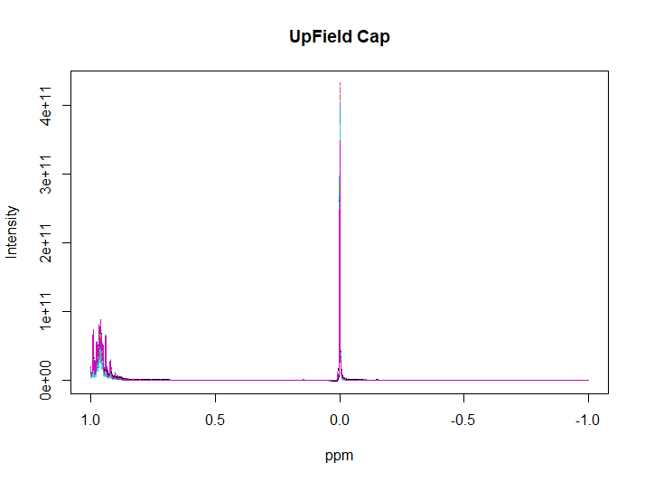

The NMR spectra for up field

### Step 12. Cut unwanted region including TSP, water and noise
#### 12.1 TSP region
- **Check TSP region**
```
#Check TSP region
matspec(X, ppm, shift = c(-0.05, 0.05), interactive=F)
```

**You will obtain the result below**

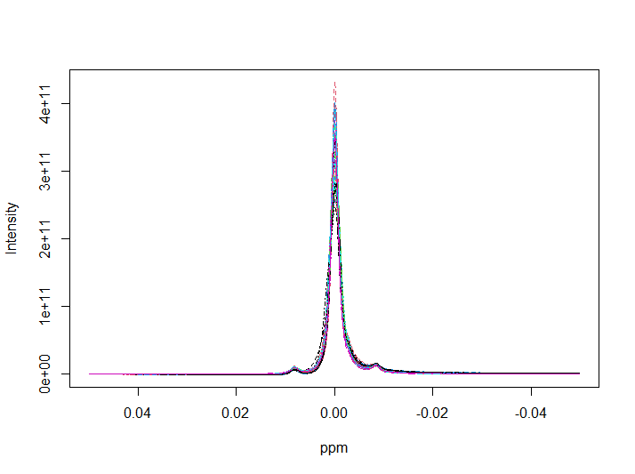

- **Specify TSP region to be removed** 
```
#Specify TSP region to be removed
idx_tsp=get_idx(range=c(min(ppm), 0.5), ppm)
```

#### 12.2 Water region
- **Check water region** 
```
#Check water region
matspec(X, ppm, shift = c(4.75, 5), interactive=F)
```

**You will obtain the result below**


- **Specify water region to be removed**
```
#Specify water region to be removed
idx_water=get_idx(range=c(4.75, 4.98), ppm)
```

#### 12.3 Down field noise region (ppm 9-10) 
- **Check down field noise region**
```
#Check downfield noise region
matspec(X, ppm, shift = c(8, 10), interactive=F)
```

**You will obtain the result below**


- **Specify downfield noise to be removed**
```
#Specify downfield noise to be removed
idx_noise=get.idx(range=c(9, max(ppm)), ppm)
```

#### 12.4 Gather all regions to be removed and excision of TSP, water and noise regions
```
#Gather all regions to be removed
idx_rm=c(idx_tsp, idx_water, idx_noise)

# Exision of TSP, res. water and noise regions
X_cut=X_cal[,-idx_rm]
ppm=ppm[-idx_rm]
```

### Step 13. Baseline correction
```
# Baseline correction
X_bl=bcor(X_cut)
```
**Visual assessment**
```
# visual assessment
Xcompare=rbind(X_bl[1,], X_cut[1,])
matspec(Xcompare, ppm, shift = c(7, 9), interactive=F)
matspec(Xcompare, ppm, shift = c(3,4), interactive=F)
```
**You will obtain the result below**


The red dash line represents the uncorrected baseline, the black line represents the baseline correction spectrum. 


### Step 14. Normalisation with PQN method 
```
# PQN normalisation
X_pqn=pqn(X_bl, add_DilF = 'NULL')
```

### Step 15. Visual inspection of the pre-processed NMR spectra

```
#The visual inspection of the pre-processed NMR spectra:
matspec(X_pqn, ppm, shift = range(ppm), interactive=F)                                 
matspec(X_pqn, ppm, shift = c(1.2, 1.7), interactive=F)
```

**You will obtain the result below**


The pre-processed NMR spectra at ppm 1-9.

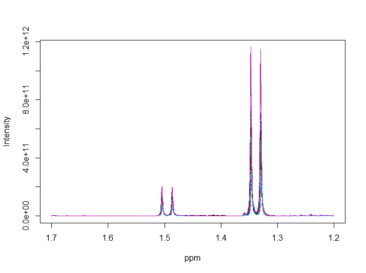

The pre-processed NMR spectra at ppm 1.2-1.7.

### Step 16. Export NMR spectra to data table
#### 16.1 Transpose data of x_pqn and ppm

```
#Transpose NMR data to create csv file
x_pqn2 <- t(x_pqn)
ppm2 <- t(ppm)
```

#### 16.2 Export NMR data to .csv file 

```
#Export NMR data to .csv file
write.table(X_pqn2, file = "x_pqn2", quote = FALSE, sep = ", ",
            eol = "\n", na = "NA", dec = ".", row.names = FALSE,
            col.names = TRUE, qmethod = c("escape", "double"),
            fileEncoding = "")

write.table(ppm3, file = "ppm3", quote = FALSE, sep = " ,",
            eol = "\n", na = "NA", dec = ".", row.names = FALSE,
            col.names = TRUE, qmethod = c("escape", "double"),
            fileEncoding = "")
 ```

#### 16.3 Open csv file in excel to rearrange the format file for multivariate analysis


---
[↥ **Back to top**](#top)
## The Galaxy environment <a name="lcms"></a>
In order to share metabolomics analysis strategies and centralize tools and practices, the web-based platform Galaxy] is the core component of the W4M infrastructure. This web-based platform is open source with a very active community which insures up-to-date software releases and efficient support for both end-users and tools developers. Galaxy provides several interesting features for metabolomics tools integration compared to other workflow engines, which include: no known data size limitations [4], possibilities to automate pipelines, and to ensure reproducibility. Because of its web interface, this cross-platform system enables scientist without programming experience to design and run analysis workflows.
The main features of this platform are:
- A real benefit to users with results traceability and storage,
- The ability to share results between users/labs/platforms,
- The possibility to use a complete analysis workflow managing environment.

Galaxy provides an ergonomic interface for tools and workflows **(Figure 1).**

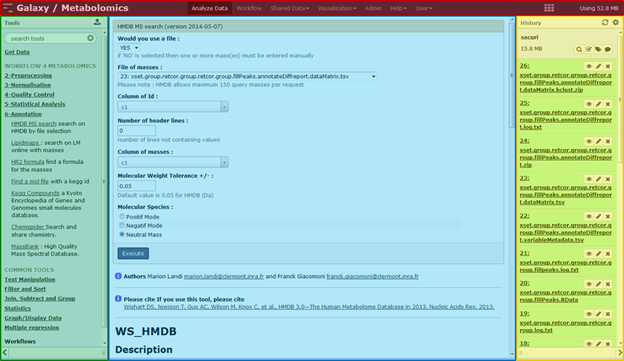

**Figure1: Main interface of the Galaxy interface.** The main window is divided into a main menu (top red part), the tools list (from pre-processing to annotation, left green panel), the current history (right yellow panel) and the central visualization panel (in purple).
First, the interface is designed to be accessible: users without programming experience can easily specify parameters and run tools and workflows. Second, Galaxy is not only a computing tools runner but also an interesting way to share and publish analyses through the web and interactive web-based documents describing a complete analysis project.
In terms of computing infrastructure, the Galaxy platform “Workflow4metabolomics” is hosting on one of the French Bioinformatics Institute nodes: the Analysis and Bioinformatics for Marine Science (ABiMS) laboratory. Technically, Galaxy was deployed in a virtual environment based on VMWARE. Optimization efforts, such as connections pool or web services decoupling, allow a good level of scalability. Computing resources connection uses the standard DRMAA API, and is completed with a dedicated connector (tool runner) in order to make available adequate resources both in terms of high computing performance and memory amount (up to 1TB RAM). Finally, a shared and secure storage space completes this layer, essential to smoothly working treatments.

## Raw data pre-processing with XCMS
XCMS is a free software dedicated to pre-processing any types of mass spectrometry acquisition files from low to high resolution including FT-MS data coupled with different kind of chromatography (liquid or gaz). This software is used worldwide by a majority of specialists of metabolomic using mass spectrometry methods.
This software is based on different algorithms that have been published and is maintained on the R repository.
XCMS is able to read files with open format as mzXML and netCDF which are independent of the constructors' formats.
It is composed of R functions able to extract, filter, align, fill gap and annotate isotopes, adducts and fragments. This set of functions gives a modularity particularly well adapted to defined workflows which is one of the key points of Galaxy **(Figure 2)**


**Figure2: LCMS preprocessing workflow.**

https://training.galaxyproject.org/training-material/topics/metabolomics/tutorials/lcms-preprocessing/slides-plain.html

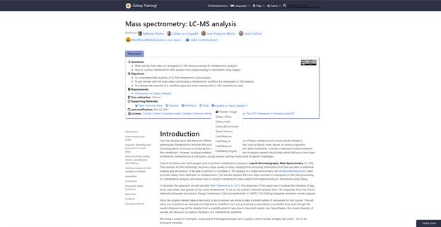

The metabolome analysis workflow is available at the following servers and docker image

https://usegalaxy.eu/
https://africa.usegalaxy.eu/
https://india.usegalaxy.eu/
https://streetscience.usegalaxy.eu/
https://usegalaxy.org.au/
https://workflow4metabolomics.usegalaxy.fr/


For those of you who do not want to upload your data to server, galaxy can be run locally in your PC using docker

## LC-MS data pre-processing 
### Step 1. Upload data 
- Collection
- Select local file
- Select workshop dataset 
- File type mzXML
- Start
- After upload completed click build, name the list as mzXML


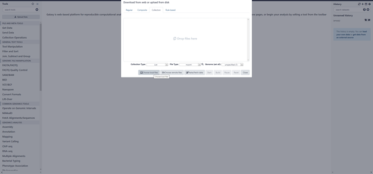


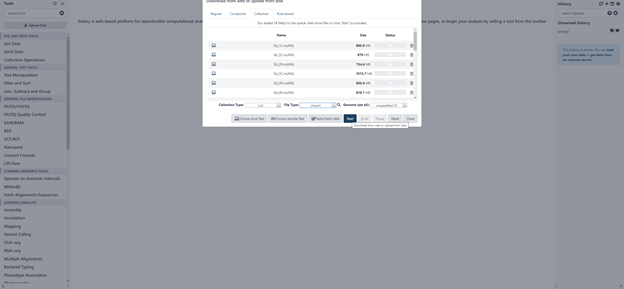

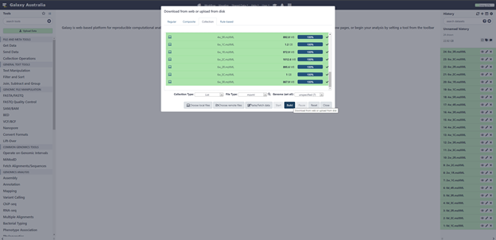


### Step 2. Read data using XCMS: MSnbase readMSData
- Type in the tool search box readMSData
- Select XCMS: MSnbase readMSData
- Select mzXML collection
- Execute

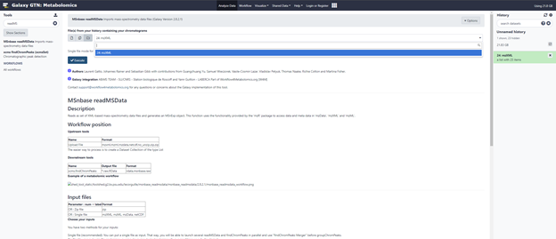


### Step 3. Create and upload meta data as tab delimited file
- Create metadata in MS excel
- Save as tab-delimited (.txt) file
- Upload to galaxy (file type tabular)

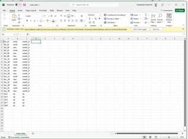


### Step 4. Create and upload meta data as tab delimited file
#### This tool generates Base Peak Intensity Chromatograms (BPIs) and Total Ion Chromatograms (TICs). If you provide groups as we do here, you obtain two plots: one with colours based on provided groups, one with one colour per sample.

- Type in the tool search box “xcms plot chromatogram”
- Select mzXML.raw.RData as input > execute
- When the process complete click the eye button to visualize the data


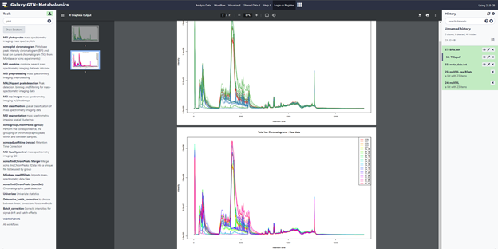

### Step 5. Peak picking
Now that your data is ready for XCMS processing, the first step is to extract peaks from each of your data files independently. The idea here is, for each peak, to proceed to chromatographic peak detection.
The XCMS solution provides two different algorithms to perform chromatographic peak detection: matchedFilter and centWave. The matchedFilter strategy is the first one provided by the XCMS R package. It is compatible with any LC-MS device, but was developed at a time when high resolution mass spectrometry was not common standard yet. On the other side, the centWave algorithm (Tautenhahn et al. 2008) was specifically developed for high resolution mass spectrometry, dedicated to data in centroid mode. In this tutorial, you will practice using the centWave algorithm.

- Type in the tool search box “peak picking”
- Select xcms findChromPeaks
- Select mzXML.raw.RData as input > execute


### Step 6. Merging peak data into one data 

- Type in the tool search box “merge”
- Select xcms findChromPeaks Merger
- Select mzXML.raw.xset.RData as input > execute


### Step 7. Group chromatogram peak

- Type in the tool search box “group”
- Select xcms groupChromPeak
- Select xset.merged.RData as input > execute


### Step 8. Retention time correction

- Type in the tool search box “retcor”
- Select xcms adjustRtime
- Select xset.merged.group.Chrom.RData as input > execute
- Repeat step 7 with xset.merged.group.Chrom.adjustRtime.RData as input > execute


### Step 9. Fill peaks

- Type in the tool search box “fillPeaks”
- Select xcms fillChromPeaks (fillPeaks)
- Select xset.merged.group.Chrom.adjustRtime.groupChromPeaks.RData as input > execute
 as input > execute
 
 

 


---
[↥ **Back to top**](#top)
