# Data analysis

## Table of Contents
1. [Overview and Aims](#overview)
2. [Introduction to MetaboAnalyst](#intro)
3. [NMR-based metabolome data analysis using MetaboAnalyst](#nmrbased)
4. [LC-MS/MS – based metabolome data analysis using MetaboAnalyst](#lcmsbased)
5. [Extra box 1](#extra1)

---

## Overview and Aims 
In this module, we will cover key concepts in NMR-based and LC-MS/MS – based metabolome data analysis. We will use pre-processed spectra data for conducting chemometrics analysis in order to visualise the patterns, trends, selecting outliers, or further investigating the classification and potential biomarkers. We will use the example data of Pla-ra that were prepared by two methods and collected at three different time points. We could ask if and how the metabolic profiling of Pla-ra collected is different over time and how those differences are affected by the methods of preparation. 

---
[↥ **Back to top**](#top)

## Introduction to MetaboAnalyst 
MetaboAnlayst created by Wishart Research Group (University of Alberta, Canada) is a web-based platform for metabolomic data analysis and interpretation. Since the first version released in 2009, the platform has undergone continuous development and expansion in a variety of functional models that have been tailored for metabolomic data including data processing, statistical analysis, functional enrichment analysis, and metabolic pathway analysis. The platform also supports a wide array of data input types generated from different metabolomic approaches consisting of metabolite concentrations, spectra bins/peak table, MS/NMR peak lists or intensity table, and LC-MS raw spectra. Given its strengths in analysis methods and diverse data input, MetaboAnalyst is recognised as a friendly and comprehensive platform for metabolomics data analysis. 

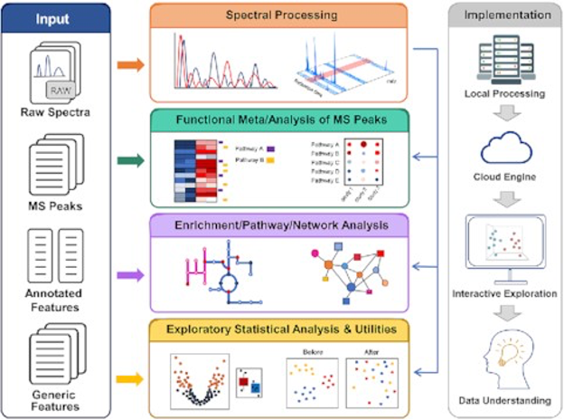
(Obtained from Nucleic Acids Res, Volume 49, Issue W1, 2 July 2021, Pages W388–W396, https://doi.org/10.1093/nar/gkab382)

### Let’s start 
To get started, open any web browser and go to https://www.metaboanalyst.ca/ for the main interface of MetaboAnalyst. The current window displays information regarding news & updates in the top centre, main menu in the left, and introduction of modules by scrolling down. To get to the module view and functions,  click the red button in the middle centre “Click here to start”.

Alternatively, the address https://www.metaboanalyst.ca/MetaboAnalyst/ModuleView.xhtml can be used to access directly to the page. The current window provides direct access and detailed information for each module. In the left panel is a different directory related to the platform. The user can learn the command to handle each module in “Tutorials” or search for solutions for common questions and errors in “FAQs” . Here we would like to emphasise the instruction for “Data Formats” as it is the important initial step for every further process.  

  

### Dataset preparation for MetaboAnalyst analysis
As mentioned above, MetaboAnalyst supports a wide array of data input types generated from different metabolomic approaches that are suitable for different analysis paths in the platform. However, to be compatible with the platform commands, the transformation or arrangement of the dataset following guidelines is necessary. 

There are four data formats that can be used in MetaboAnalyst including Comma Separated Values (.csv), Tab Delimited Text (.txt), mzTab 2.0-M files (.mzTab), and Zipped files (.zip). The instruction and special notes of each format are provided in section “General”. Also, next to this section are the instructions for different data types and analysis paths. 

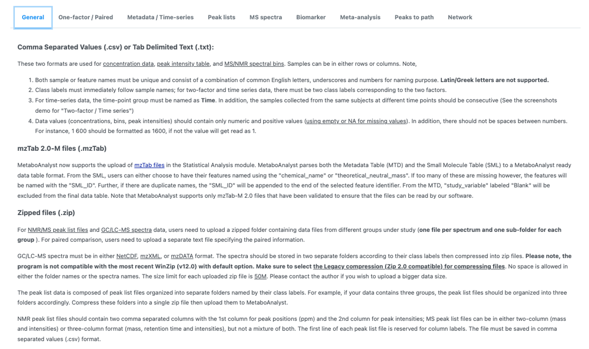

---
[↥ **Back to top**](#top)

## NMR-based metabolome data analysis using MetaboAnalyst 
For this module, the chosen example dataset is Pla-ra samples derived NMR intensity with two different prepared methods (Raw and Cooked) and collected at three different time points (day 0, 2 weeks, and 6 weeks).  Moreover, the odour satisfaction score was also provided. 

For MetaboAnalyst analysis, the dataset is collected and arranged in Excel as following: 
- **Data Format**: .csv 
- **Column**: Sample ID and Sample label
- **Row**: variables

### Data analysis using MetaboAnalyst
#### Data uploading and processing
##### ***Data uploading***
After the preparation for data file is completed, we can go back to MetaboAnalyst Module View and click “Statistical Analysis [one factor]" to start the analysis process. 

In the box of “A plain text (.txt or .csv)", select the information and follow the steps as below:
- **Data Type**: Peak intensities
- **Format**: Sample in columns (unpaired)
- **Data File**: click “Choose” to upload the data file (.csv file)
- Click **Submit**

##### ***Data processing***
The main steps of data processing include Data check, Missing value, Data filter, Data editor, and Normalisation.  
*Data check & Missing value*
- The commands help to check the integrity of the data file and provide the editing window for group labels. It is necessary to look over a few important pieces of information such as number of samples, number of groups, and missing values before processing next steps. 

*Data filter*
- The purpose of this step is to filter non-information variables such as baseline noises. MetaboAnalyst provides detailed explanations and suggestions for data filtering methods in their platform. For this module, we suggest using the “None” option to allow maximum variables for analysis. 

*Normalisation*
- MetaboAnalyst provides the normalisation procedures with three categories to improve the quality of your dataset such as sample normalisation, data transformation, and data scaling. For this module, as the example dataset has undergone the preprocessing procedure, thus, none of the strategies is required.

In case your dataset requires normalisation procedures, after selecting and normalising, you can click “View Result” to review the results and to compare “before” and “after” processes.

#### Statistical analysis
After data processing, the tool box appears with different analysis paths to select such as univariate analysis, chemometrics analysis, or cluster analysis. In this module, we introduce the process of chemometrics analysis, specifically principal component analysis (PCA) and orthogonal partial least squares - discriminant analysis (O-PLS-DA). 

##### ***Principal component analysis (PCA)***
The PCA is used to study the metabolic overview, similarities, and differences of all samples. 

The visualisation of PCA results can be reviewed by different kinds of plots provided by MetaboAnalyst. The first plot “Overview” displays pairwise score plots of PCA results from top 5 principal components (PCs). 

Next to that is the “Scree Plot” which displays the accumulated variance explained and the variance explained by individual PC. 
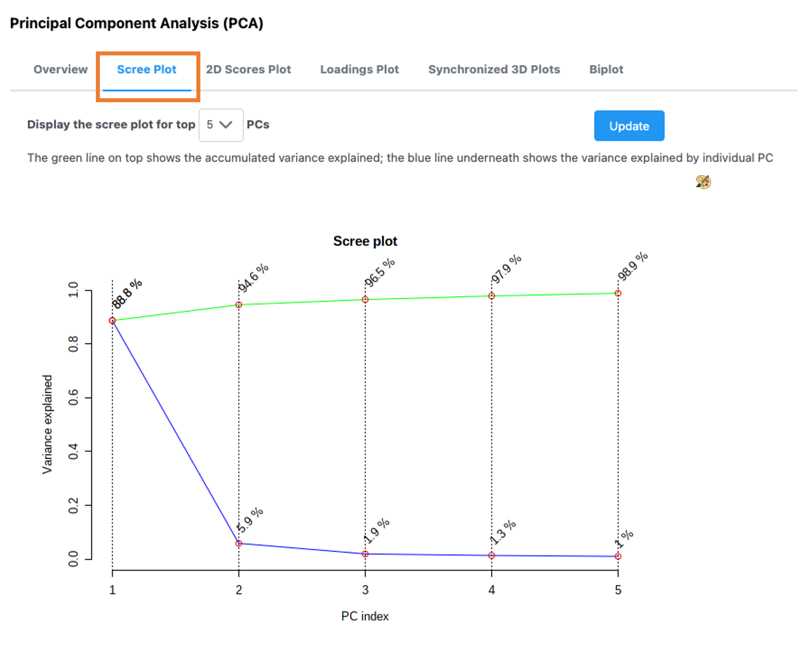

In addition, “2D Scores Plot” can be used to study the clustering between groups.

##### ***Orthogonal partial least squares - discriminant analysis (O-PLS-DA)***
The O-PLS-DA is used to investigate further in pairwise comparison aiming to identify the differences between groups. Therefore, it requires the step to select two interested groups for the analysis through “Data editor”. For the current dataset, the example is conducted for a pairwise comparison model between “Raw_day 0” and “Raw_2 weeks”. 
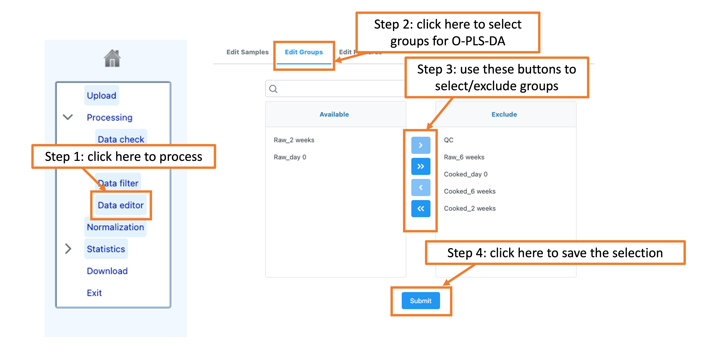

After the normalisation step which follows the instructions mentioned above, the analysis can be performed straight away by clicking “OrthPLSDA” in the left panel under “Statistics” section. Similar to PCA, the visualisation of O-PLS-DA results can be reviewed by different kinds of plots provided by MetaboAnalyst. The first “Score Plot” demonstrates the significant class discrimination between “Raw_day 0” and “Raw_2 weeks”.

Further, the “Imp. Feature (S-plot)” represents the variable influence in an O-PLS-DA model. It combines the covariance and correlation loading profiles. The loading plots combine a scatter plot “p[1]” which describes the magnitude of each variable within a model, and “p(corr)[1]” which represents the reliability of each variable (model correlation). What’s more, we can choose the significance discriminated variable, click on it to access “Feature View” which is a box and whisker plot representing the difference in relative concentrations of this particular variable. 
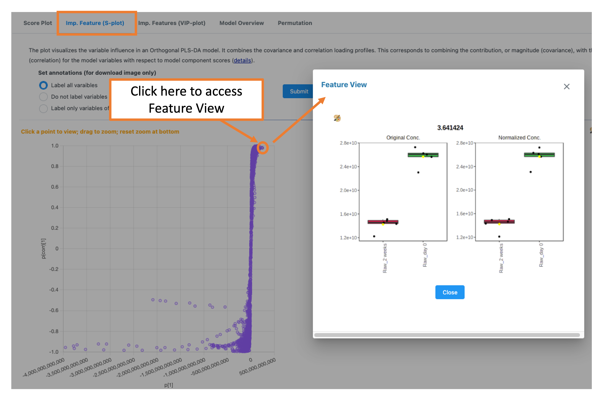

In the same window, we can also take a look at the table summarised from values of “p[1]” and “p(corr)[1]” by clicking on “View the detailed data table”. The variables at the outermost bottom and top of the loading plot were sorted in the order of potentially relevant metabolites with significant differences in the pairwise comparison. Thus, these potentially variables (or chemical shift, ppm) can be employed for further metabolite identification.
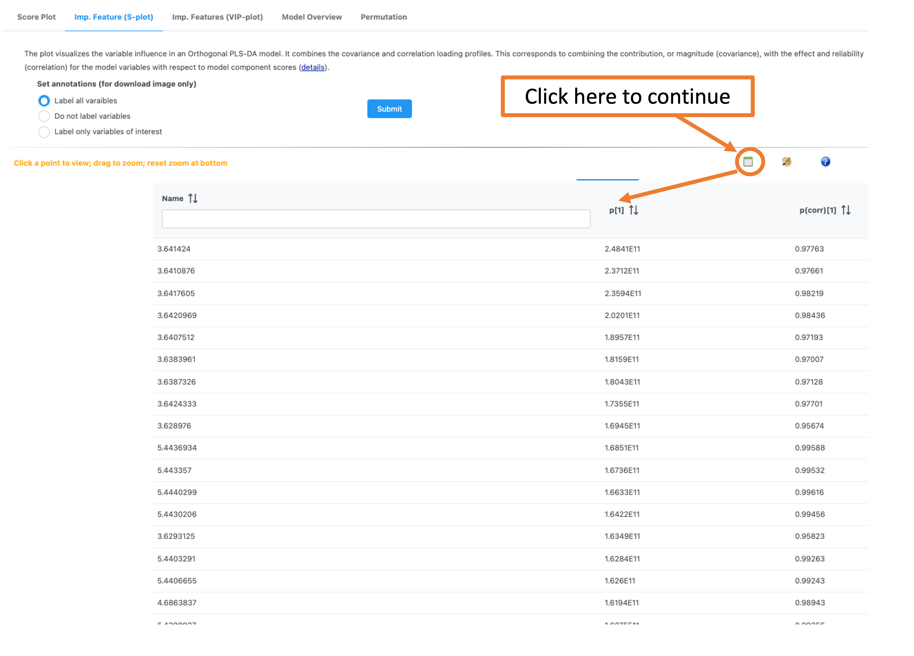

The statistical parameters obtained from the current O-PLS-DA model, such as the fitness and predictability determined by  R2X, R2Y, and Q2 values, can be reviewed in “Model Overview”. 

Last but not least, the computationally intensive procedure known as “Permutation” can also be carried out in the same window, next to “Model Overview”.  Depending on the size of the dataset, we could set the appropriate number for permutation.
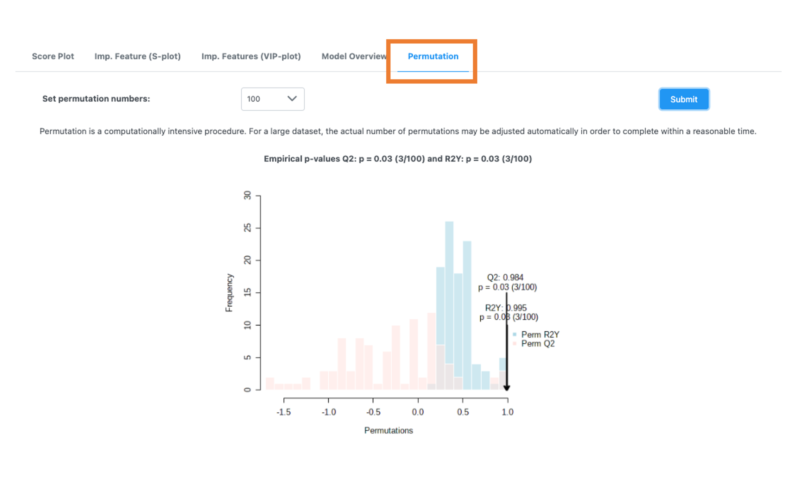

### Download Results
The results from MetaboAnalyst (all tables and figures) can be downloaded in “Download” section located in the left panel. We can either choose to download single files or all the files composed in “Download.zip”. In addition, a PDF analysis report can also be generated using the button “Generate Report”. 

---
[↥ **Back to top**](#top)

## LC-MS/MS – based metabolome data analysis using MetaboAnalyst 
For this module, the chosen example dataset is Pla-ra samples derived from LC-MS/MS peak intensity with two different prepared methods (Raw and Cooked) and collected at three different time points (day 0, 2 weeks, and 6 weeks).  Moreover, the odour satisfaction score was also provided. 

For MetaboAnalyst analysis, the dataset is collected and arranged in Excel as following: 
- **Data Format**: .csv 
- **Column**: Sample ID and Sample group
- **Row**: variables
- All the variables from “Extract blank” and “Recon blank” must be cut off from the data table. 
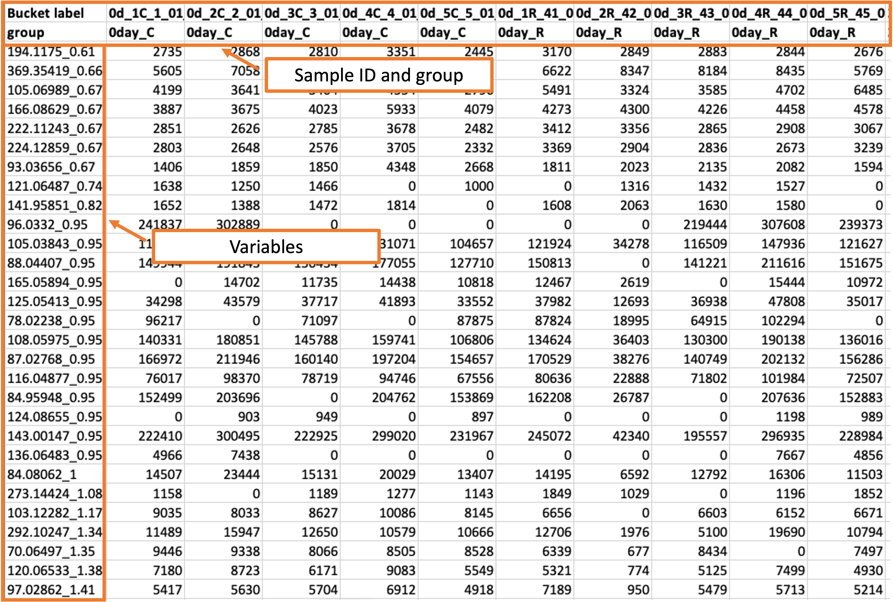

### Data analysis using MetaboAnalyst
#### Data uploading and processing
##### ***Data uploading***
After the preparation for data file is completed, we can go back to MetaboAnalyst Module View and click “Statistical Analysis [one factor]” to start the analysis process. 

In the box of “A plain text (.txt or .csv)", select the information and follow the steps as below:
- **Data Type**: Peak intensities
- **Format**: Sample in columns (unpaired)
- **Data File**: click “Choose” to upload the data file (.csv file)
- Click **Submit**

##### ***Data processing***
The main steps of data processing include Data check, Missing value, Data filter, Data editor, and Normalisation.  
*Data check & Missing value*
- The commands help to check the integrity of the data file and provide the editing window for group labels. It is necessary to look over a few important pieces of information such as number of samples, number of groups, and missing values before processing next steps. 
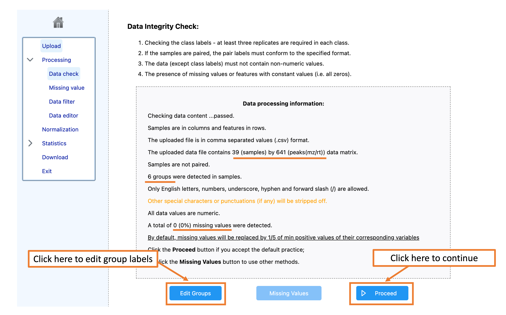

*Data filter*
- The purpose of this step is to filter non-information variables such as baseline noises. MetaboAnalyst provides detailed explanations and suggestions for data filtering methods in their platform. For this module, we suggest using the “None” option to allow maximum variables for analysis. 

*Normalisation*
- MetaboAnalyst provides the normalisation procedures with three categories to improve the quality of your dataset such as sample normalisation, data transformation, and data scaling. For this module, as the example dataset has undergone the preprocessing procedure, thus, none of the strategies is required.

In case your dataset requires normalisation procedures, after selecting and normalising, you can click “View Result” to review the results and to compare “before” and “after” processes.

#### Statistical analysis
After data processing, the toolbox appears with different analysis paths to select such as univariate analysis, chemometrics analysis, or cluster analysis. In this module, we introduce the process of chemometrics analysis, specifically principal component analysis (PCA) and orthogonal partial least squares - discriminant analysis (O-PLS-DA). 

##### ***Principal component analysis (PCA)***
The PCA is used to study the metabolic overview, similarities, and differences of all samples. 

The visualisation of PCA results can be reviewed by different kinds of plots provided by MetaboAnalyst. The first plot “Overview” displays pairwise score plots of PCA results from top 5 principal components (PCs). 

Next to that is the “Scree Plot” which displays the accumulated variance explained and the variance explained by individual PC. 
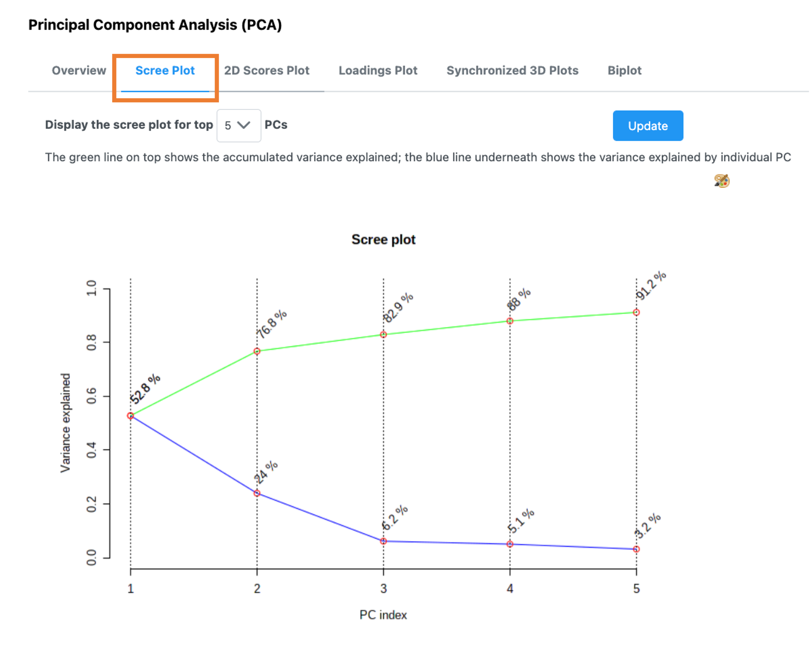

In addition, “2D Scores Plot” can be used to study the clustering between groups.
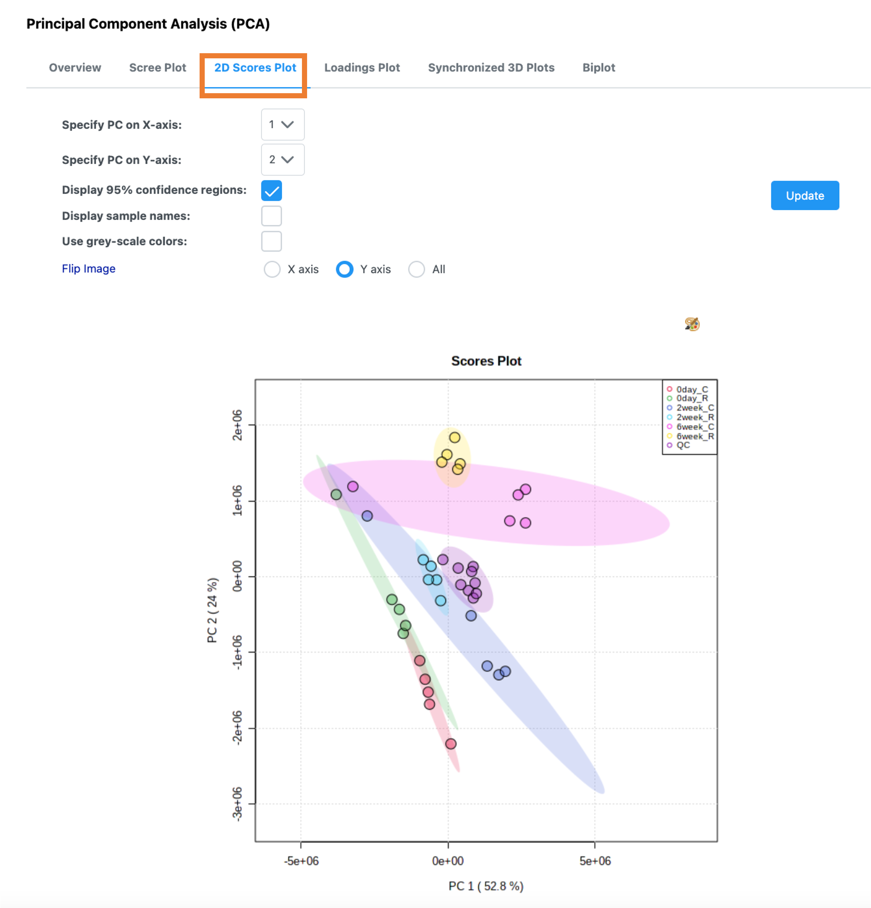

##### ***Orthogonal partial least squares - discriminant analysis (O-PLS-DA)***
The O-PLS-DA is used to investigate further in pairwise comparison aiming to identify the differences between groups. Therefore, it requires the step to select two interested groups for the analysis through “Data editor”. For the current dataset, the example is conducted for a pairwise comparison model between “Raw_day 0” and “Raw_2 weeks”. 

After the normalisation step which follows the instructions mentioned above, the analysis can be performed straight away by clicking “OrthPLSDA” in the left panel under “Statistics” section. Similar to PCA, the visualisation of O-PLS-DA results can be reviewed by different kinds of plots provided by MetaboAnalyst. The first “Score Plot” demonstrates the significant class discrimination between “Raw_day 0” and “Raw_2 weeks”.

Further, the “Imp. Feature (S-plot)” represents the variable influence in an O-PLS-DA model. It combines the covariance and correlation loading profiles. The loading plots combine a scatter plot “p[1]” which describes the magnitude of each variable within a model, and “p(corr)[1]” which represents the reliability of each variable (model correlation). What’s more, we can choose the significance discriminated variable, click on it to access “Feature View” which is a box and whisker plot representing the difference in relative concentrations of this particular variable. 
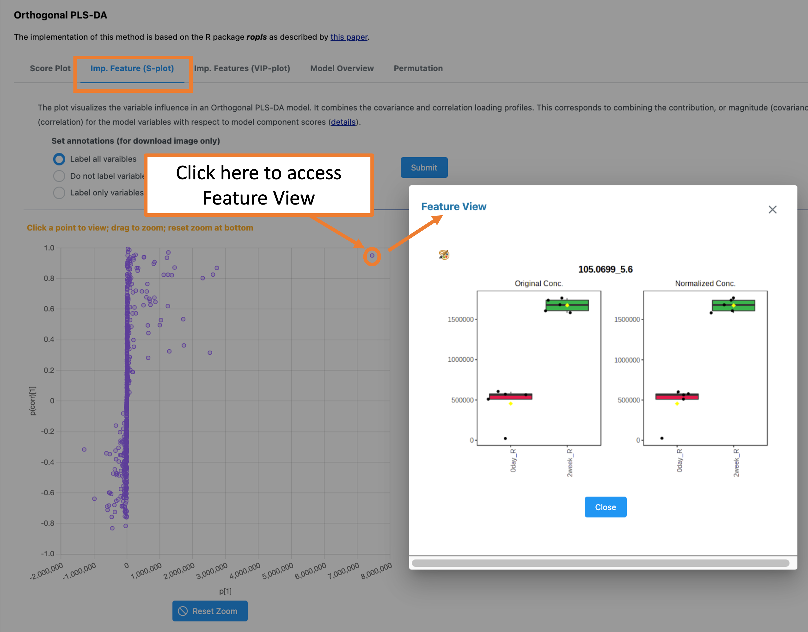

In the same window, we can also take a look at the table summarised from values of “p[1]” and “p(corr)[1]” by clicking on “View the detailed data table”. The variables at the outermost bottom and top of the loading plot were sorted in the order of potentially relevant metabolites with significant differences in the pairwise comparison. Thus, these potentially variables (or chemical shift, ppm) can be employed for further metabolite identification.
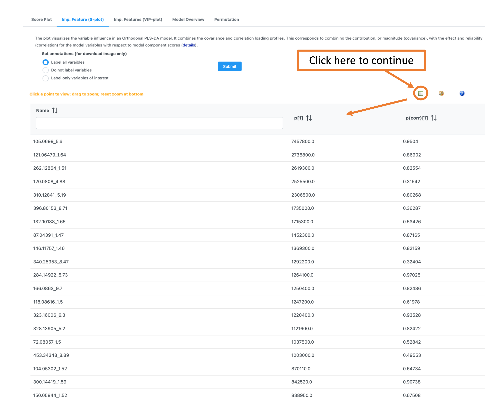

The statistical parameters obtained from the current O-PLS-DA model, such as the fitness and predictability determined by  R2X, R2Y, and Q2 values, can be reviewed in “Model Overview”. 

Last but not least, the computationally intensive procedure known as “Permutation” can also be carried out in the same window, next to “Model Overview”.  Depending on the size of the dataset, we could set the appropriate number for permutation.
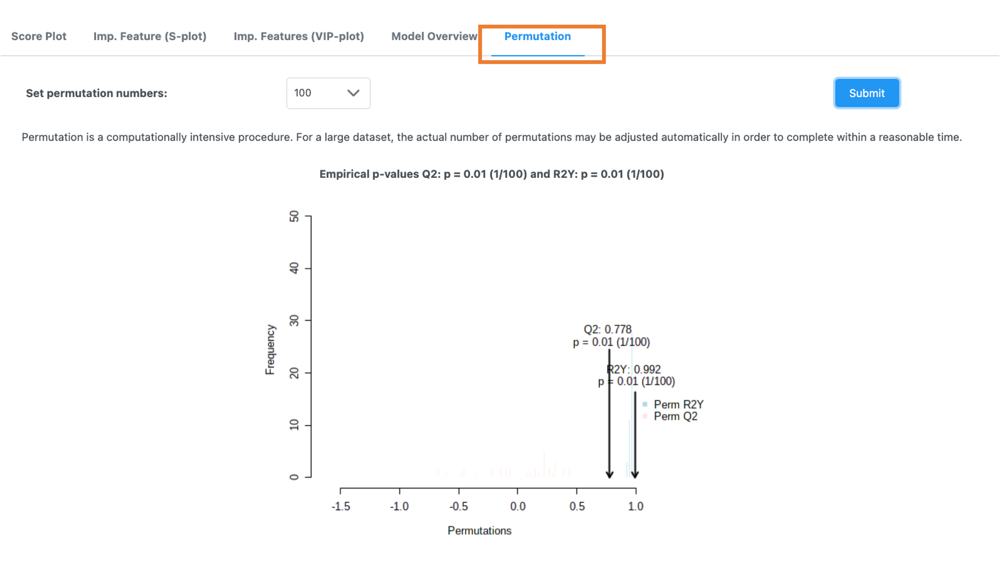

### Download Results
The results from MetaboAnalyst (all tables and figures) can be downloaded in “Download” section located in the left panel. We can either choose to download single files or all the files composed in “Download.zip”. In addition, a PDF analysis report can also be generated using the button “Generate Report”. 

