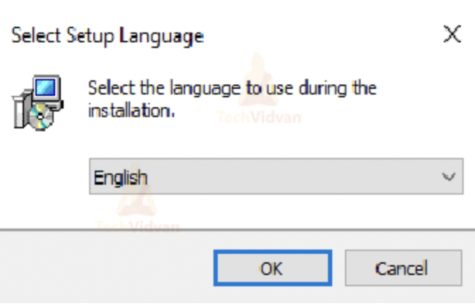
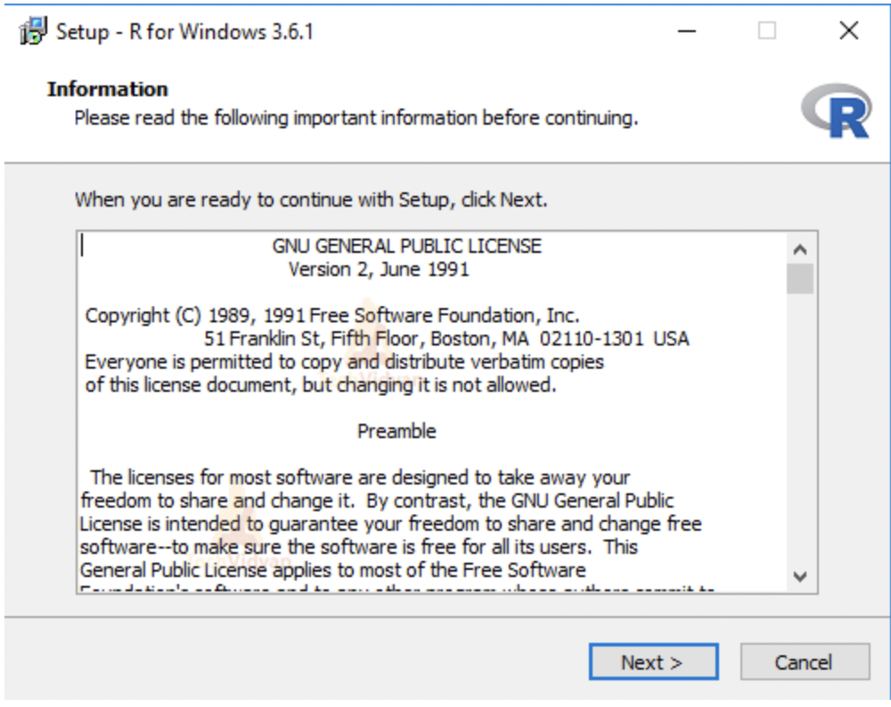
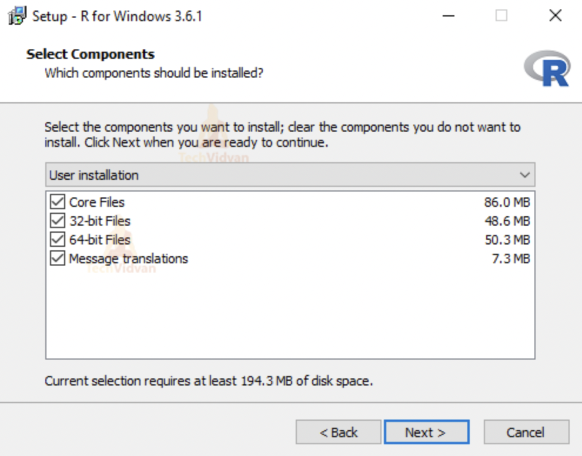
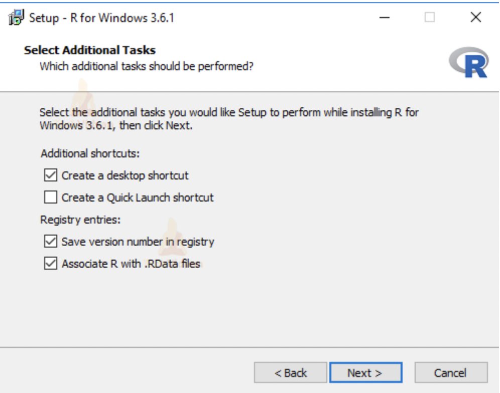
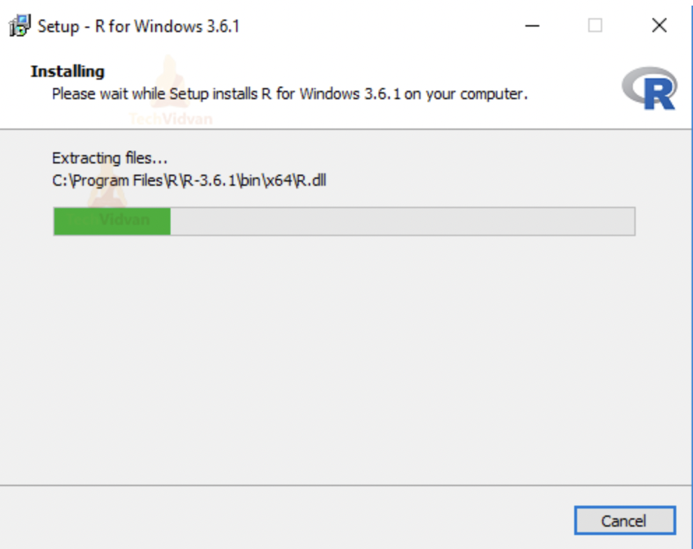
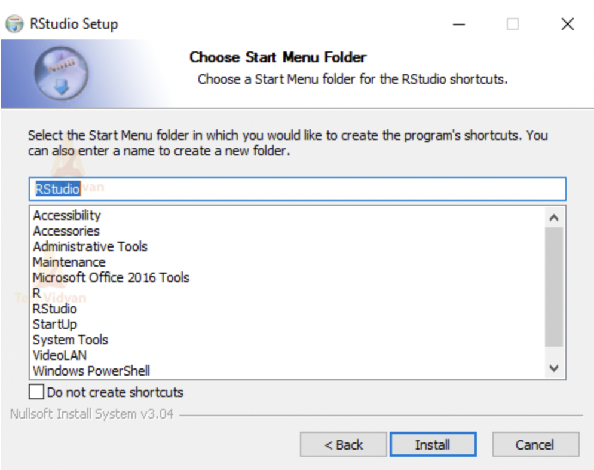
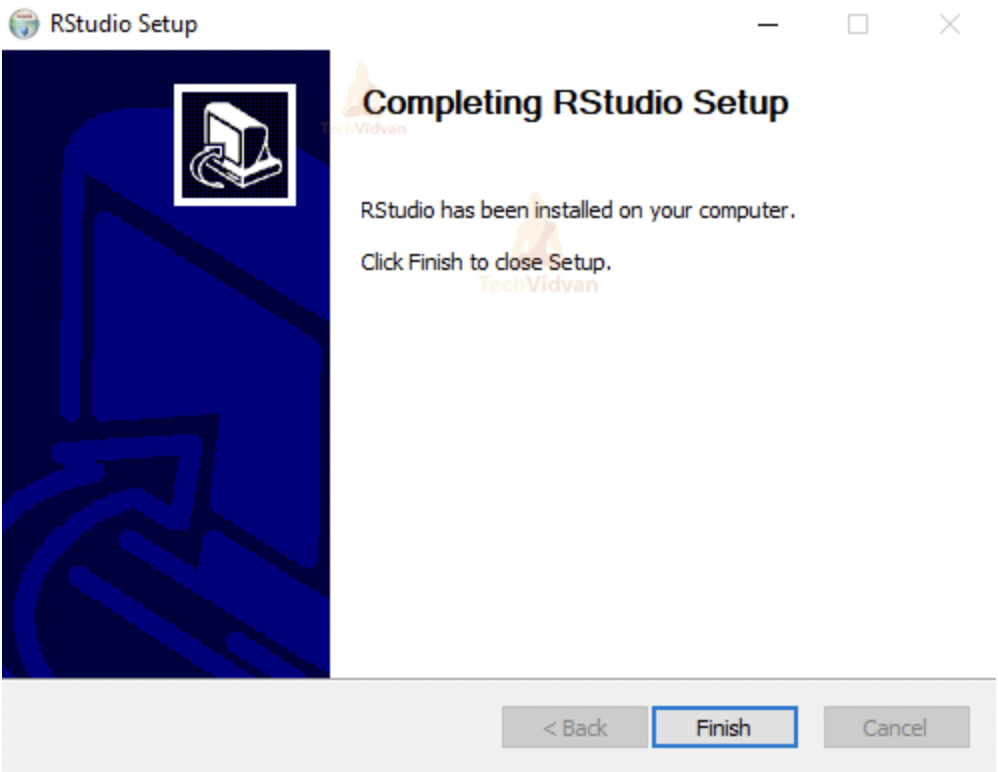

# Software installation

## Table of Contents
1. [R and RStudio](#r)
2. [Galaxy server](#galaxy)
3. [MS-Dial](#msdial)

## Installing R and RStudio 
Installing R and RStudio on Windows
To install R and RStudio on windows, go through the following steps:
Install R on windows
Step – 1: Go to [CRAN R project ](https://cran.r-project.org/)website.

Step – 2: Click on the Download R for Windows link.

Step – 3: Click on the base subdirectory link or install R for the first time link.
Step – 4: Click Download R X.X.X for Windows and save the executable .exe file.
Step – 5: Run the .exe file and follow the installation instructions.
5.a. Select the desired language and then click Next.

5.b. Read the license agreement and click Next.

5.c. Select the components you wish to install (it is recommended to install all the components). Click Next.

5.d. Enter/browse the folder/path you wish to install R into and then confirm by clicking Next.

5.e. Select additional tasks like creating desktop shortcuts etc. then click Next.

5.f. Wait for the installation process to complete.

5.g. Click on Finish to complete the installation.

Install RStudio on Windows
Step – 1: With R-base installed, let’s move on to installing RStudio. To begin, go to [download RStudio](https://www.rstudio.com/ide/download) and click on the download button for RStudio desktop.
Step – 2: Click on the link for the windows version of RStudio and save the .exe file.
Step – 3: Run the .exe and follow the installation instructions.

3.a. Click Next on the welcome window.

3.b. Enter/browse the path to the installation folder and click Next to proceed.
3.c. Select the folder for the start menu shortcut or click on do not create shortcuts and then click Next.

3.d. Wait for the installation process to complete.

3.e. Click Finish to end the installation.

Installing R and RStudio on Mac OS X
To install R and RStudio on Mac OS X, go through the following steps:
Install R on Mac
Step – 1: Go to [CRAN R Project](https://cran.r-project.org./) Website.
Step – 2: Click on the Download for (Mac) OS X link.
Step – 3: Click on the link for the pkg file of the latest R version and save it.
Step – 4: Double click the downloaded file and follow installation instructions.
Install RStudio on Mac OS X
Step – 1: With the r-base installed, you need to install RStudio. To do that, go to [download RStudio](https://www.rstudio.com/ide/download)and click on the download button for the RStudio desktop.
Step – 2: Click on the link for the Mac OS X version of RStudio and save the .dmg file.
Step – 3: Double click the downloaded file and then drag-and-drop it into your applications folder.
Now with R and RStudio installed in your system, let’s look at a few packages that might help you in learning as well as using R to its fullest potential!

---
[↥ **Back to top**](#top)

## Installing Galaxy server 
Some text here

---
[↥ **Back to top**](#top)

## Installing MS-Dial 
Some text here

---
[↥ **Back to top**](#top)

