# Software installation and dataset

## Table of Contents
1. [R and RStudio](#r)
2. [Galaxy server](#galaxy)
3. [MS-Dial](#msdial)
4. [Download the dataset for this workshop](#dataset)

## Installing R and RStudio 
Installing R and RStudio on Windows
To install R and RStudio on windows, go through the following steps:
Install R on windows
Step – 1: Go to [CRAN R project ](https://cran.r-project.org/)website.

Step – 2: Click on the Download R for Windows link.

Step – 3: Click on the base subdirectory link or install R for the first time link.
Step – 4: Click Download R X.X.X for Windows and save the executable .exe file.
Step – 5: Run the .exe file and follow the installation instructions.
5.a. Select the desired language and then click Next.

5.b. Read the license agreement and click Next.

5.c. Select the components you wish to install (it is recommended to install all the components). Click Next.

5.d. Enter/browse the folder/path you wish to install R into and then confirm by clicking Next.
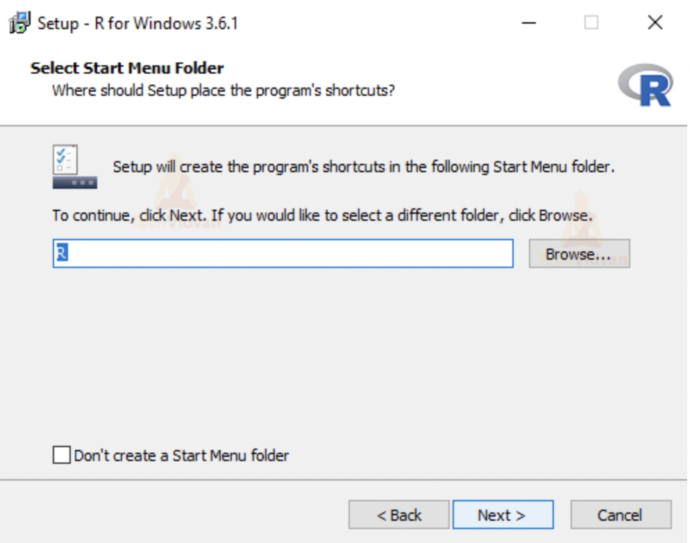
5.e. Select additional tasks like creating desktop shortcuts etc. then click Next.

5.f. Wait for the installation process to complete.

5.g. Click on Finish to complete the installation.

Install RStudio on Windows
Step – 1: With R-base installed, let’s move on to installing RStudio. To begin, go to [download RStudio](https://www.rstudio.com/ide/download) and click on the download button for RStudio desktop.
Step – 2: Click on the link for the windows version of RStudio and save the .exe file.
Step – 3: Run the .exe and follow the installation instructions.
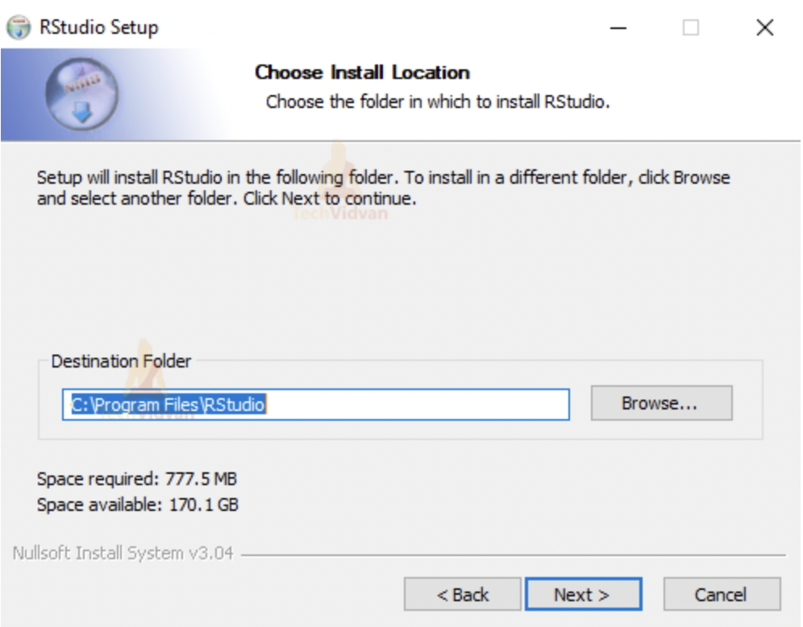
3.a. Click Next on the welcome window.

3.b. Enter/browse the path to the installation folder and click Next to proceed.
3.c. Select the folder for the start menu shortcut or click on do not create shortcuts and then click Next.

3.d. Wait for the installation process to complete.

3.e. Click Finish to end the installation.

Installing R and RStudio on Mac OS X
To install R and RStudio on Mac OS X, go through the following steps:
Install R on Mac
Step – 1: Go to [CRAN R Project](https://cran.r-project.org./) Website.
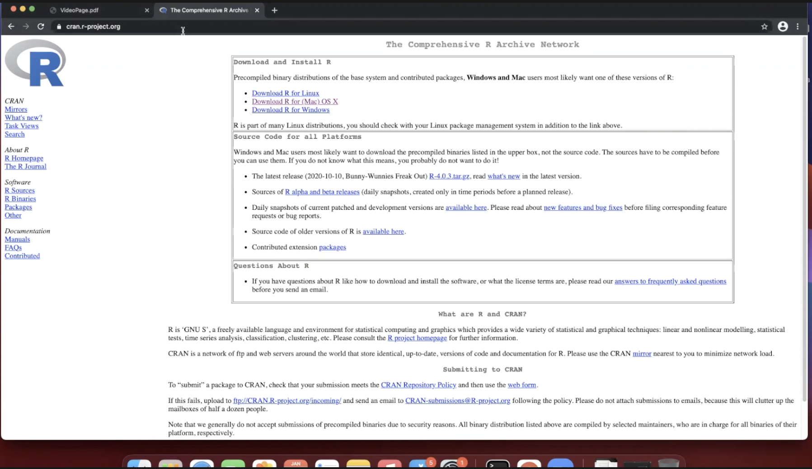
Step – 2: Click on the Download for (Mac) OS X link.

Step – 3: Click on the link for the pkg file of the latest R version and save it.

Step – 4: Double click the downloaded file and follow installation instructions.
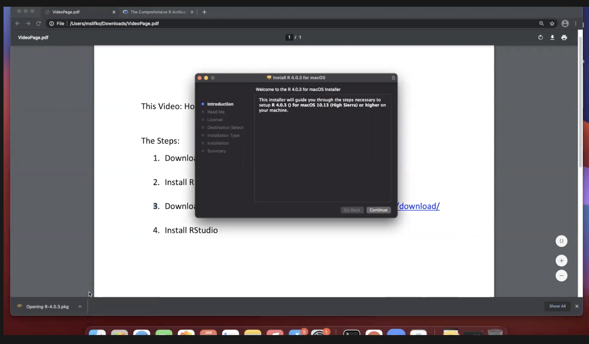

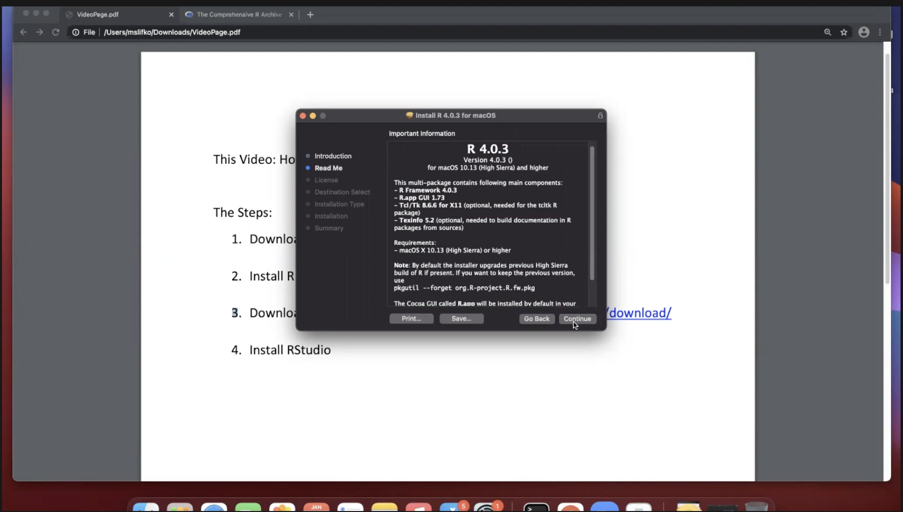
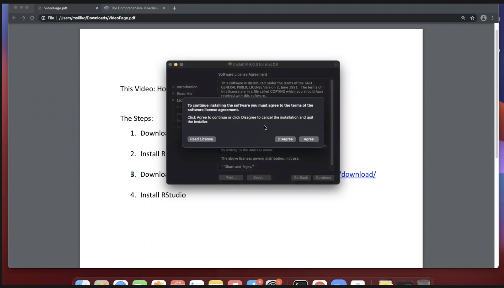

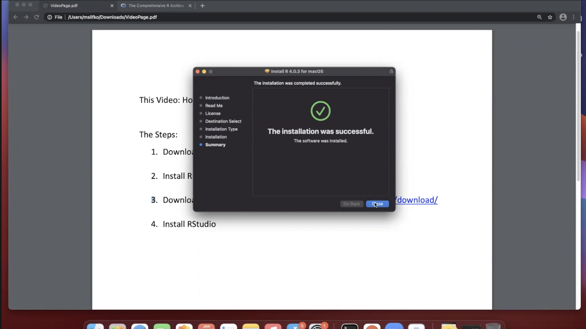

Install RStudio on Mac OS X
Step – 1: With the r-base installed, you need to install RStudio. To do that, go to [download RStudio](https://www.rstudio.com/ide/download)and click on the download button for the RStudio desktop.
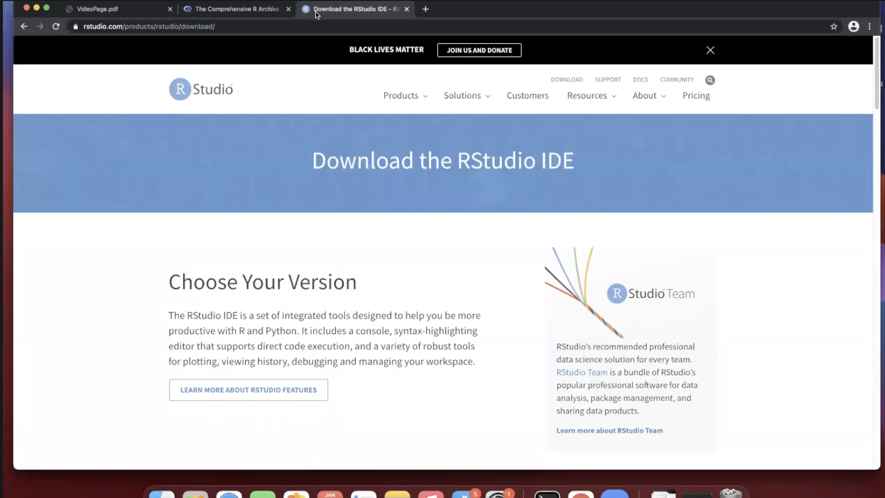
Step – 2: Click on the link for the Mac OS X version of RStudio and save the .dmg file.
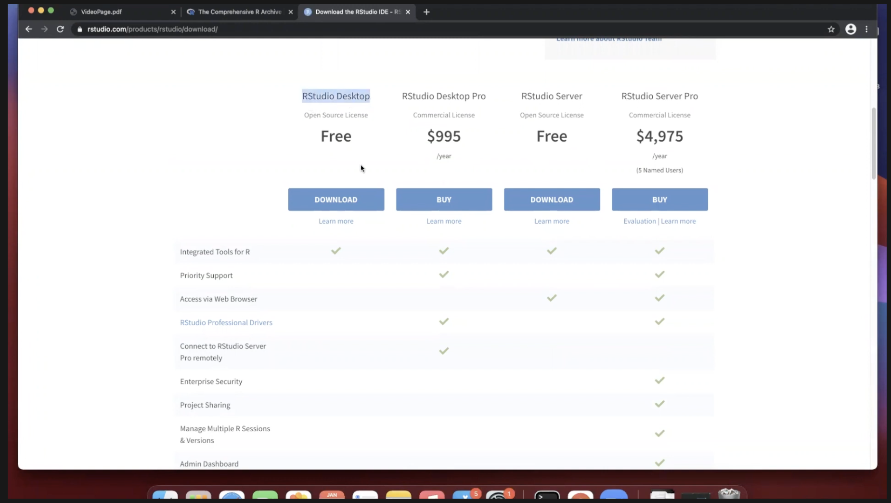
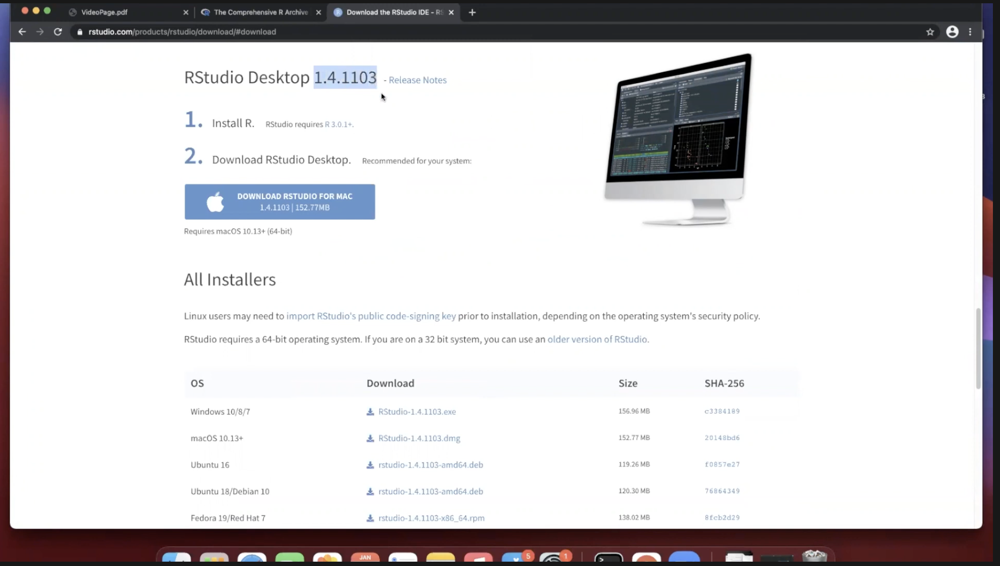
Step – 3: Double click the downloaded file and then drag-and-drop it into your applications folder.
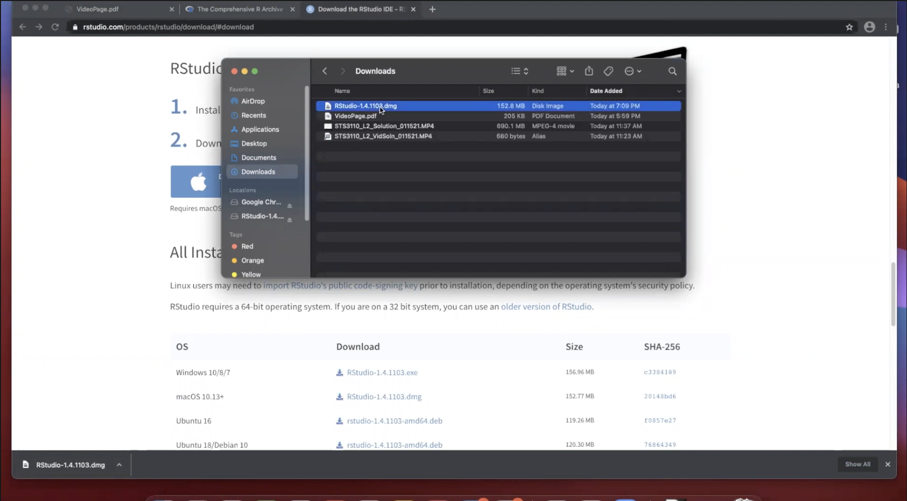
Now with R and RStudio installed in your system, let’s look at a few packages that might help you in learning as well as using R to its fullest potential!

---
[↥ **Back to top**](#top)
## Installing Docker
Introduction to docker

Docker is an open platform for developing, shipping, and running applications. Docker enables you to separate your applications from your infrastructure so you can deliver software quickly. With Docker, you can manage your infrastructure in the same ways you manage your applications. By taking advantage of Docker’s methodologies for shipping, testing, and deploying code quickly, you can significantly reduce the delay between writing code and running it in production

•	https://docs.docker.com/get-started/overview/

You can download and install Docker on multiple platforms. Refer to the following section and choose the best installation path for you.

•	https://docs.docker.com/get-docker/

## Installing Galaxy server 
Step – 1: Run docker engine and wait for the green light in the bottom left of docker desktop app

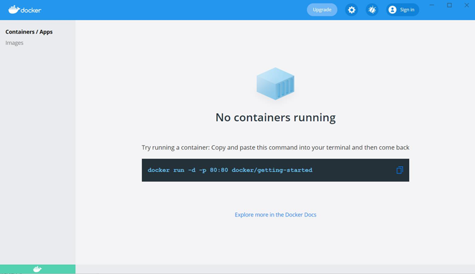

Step – 2: In terminal (macOSX) or PowerShell (Windows) type: docker pull quay.io/galaxy/metabolomics-training:latest

Step – 3: After the download was done In terminal (macOSX) or PowerShell (Windows) type: docker run -d -p 8080:80 -p 8021:21 -p 8022:22 quay.io/galaxy/metabolomics-training:latest

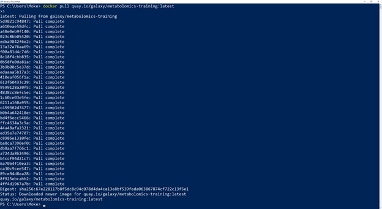
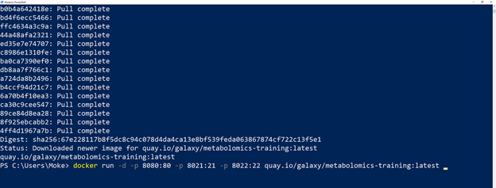

Step – 4: Set up number of CPU for the local galaxy server In docker desktop go to container/App tab > click the (>_) button >black terminal screen will pop up
Type:

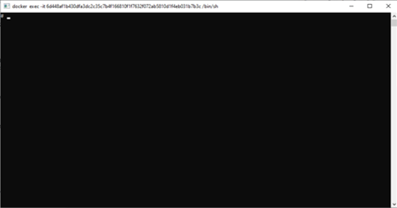

cp config/job_conf.xml.sample_basic config/job_conf.xml

nano config/job_conf.xml

How to use nano editor -> https://www.nano-editor.org/dist/v2.2/nano.html#Editor-Basics\

 1 worker require 4 GB of RAM For this example, the systems have 16 GB of RAM therefore the number of workers is set to 4.
 
 Step – 5: Access your personal galaxy server by type http://localhost:8080/ In the address bar on your favorite web browser
 

---
[↥ **Back to top**](#top)

## Installing MS-Dial 
Step – 1: Go to (http://prime.psc.riken.jp/compms/msdial/main.html) website.

Step – 2: Run the .exe file(Window) or pkg (MacOS) and follow the installation instructions.

---
[↥ **Back to top**](#top)

## Download the dataset for this workshop 
The dataset used in this workshop is available for download from [here](#)

https://drive.google.com/drive/folders/1AaxejKSMaq35L0wFVDCoce2eVf-sELPM?usp=sharing

### Data note
In "Data Analysis" sub-folder, either from NMR or LC-MS folder, there are three data files including:
- File ".xlsx" is the original data file derived from data pre-processing 
- File "NMR intensiy.csv" and "LC-MS dataset.csv" are exported from ".xlsx" by changing data format 
- File "NMR intensiy_Manual1.csv" and "LC-MS dataset_Manual1.csv" are the files used in manual (Module 4). The files have been arranged and collected information that used for data analysis in MetaboAnalyst. 

---
[↥ **Back to top**](#top)
